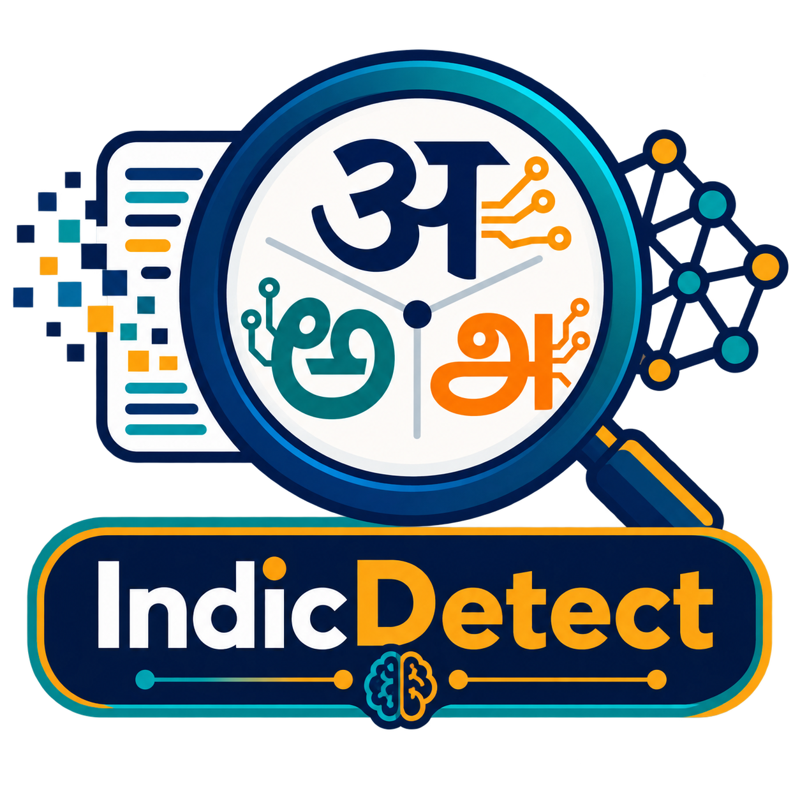

<div align="center">

</div>

<h2 align="center"> <a href="https://arxiv.org/abs/XXXX.XXXXX">[EMNLP 2026 Findings] IndicDetect: Evaluating Cross-Lingual LLM-Generated Text Detection for Hindi, Telugu, and Tamil</a></h2>

<h5 align="center"> If you like our project, please give us a star ⭐ on GitHub. </h5>

<div align="center">

[](https://arxiv.org/abs/XXXX.XXXXX)
[](https://2026.emnlp.org/)

</div>

**IndicDetect** is a benchmark for AI-generated text detection in **Hindi, Telugu, and Tamil**. It measures how well detectors hold up under realistic distribution shifts rather than idealized, matched-condition accuracy, covering four domains, three generators, and seven Brahmic-script adversarial attacks under one reproducible protocol.

---

## 📣 News

* `[2026.08.21]` ✨ Our paper is accepted to **EMNLP 2026 Findings**.
* Code and data are released. HuggingFace dataset and leaderboard coming soon.

## 🧐 Overview

<div align="center">

</div>

We pair curated human-written texts with LLM counterparts across four domains (academic, news, creative, movie reviews) and three generators (GPT-4.1, Qwen-Plus, DeepSeek-v3.2), then evaluate eight detectors under six settings: In-Distribution, In-Distribution (Domain), In-Distribution (Generator), Multi-Domain, Multi-Generator, and Multi-Attack. Robustness is stress-tested with seven meaning-preserving attacks: paraphrase, perturbation, whitespace addition, insert-paragraph, alternative spelling, misspelling, and synonym swap.

## 📁 Repository Structure

```
IndicDetect/
├── Data_Generation/
│   ├── Human_Data_Generation/          # web scrapers per language and domain
│   │   └── {Telugu,Hindi,Tamil}/       # Academic_Scrapper.py, News_Scrapper.py,
│   │                                   # Creative_Scrapper.py, Movie_Reviews_Scrapper.py
│   └── LLM_Data_Generation/            # keyword-grounded generation
│       └── {Telugu,Hindi,Tamil}/{Domain}/{Provider}/Data_Generation.py
├── Attacks/
│   ├── Dictionary_Creation_{Hindi,Telugu,Tamil}.py
│   ├── Paraphase_Attack/               # Back_Translation_{Hindi,Telugu,Tamil}.py
│   ├── Petrubation_Attack/
│   ├── WhiteSpace_Attack/
│   ├── Insert_Paragraphs_Attacks/
│   ├── Alternative_Spelling_Attack/
│   ├── Misspelling_Attack/
│   └── Synonym_Swap_Attack/
├── Benchmark_Data/                     # final benchmark splits for Hindi, Telugu, Tamil
├── Detectors/                          # detector implementations and evaluation
└── README.md
```

## 📊 Dataset

84,000 samples (≈23.5M tokens) balanced across three languages and four domains, with 500 train / 500 test splits per setting and at least 400 tokens per sample.

| Language | Human | GPT-4.1 | Qwen-Plus | DS-v3.2 | Adv. | Total |
|----------|:-----:|:-------:|:---------:|:-------:|:----:|:-----:|
| Telugu   | 4,000 | 4,000 | 4,000 | 4,000 | 12,000 | 28,000 |
| Hindi    | 4,000 | 4,000 | 4,000 | 4,000 | 12,000 | 28,000 |
| Tamil    | 4,000 | 4,000 | 4,000 | 4,000 | 12,000 | 28,000 |
| **Total** | **12,000** | **12,000** | **12,000** | **12,000** | **36,000** | **84,000** |

DS-v3.2 = DeepSeek-v3.2. Adv. = adversarial samples (1,000 per LLM × 3 LLMs per domain).

## 🏆 Leaderboard

Generalization score (mean Macro-F1 over Multi-Domain, Multi-Generator, and Multi-Attack). **Bold** = best per language. Full per-setting results are in the paper.

| Detector | Telugu | Hindi | Tamil |
|----------|:------:|:-----:|:-----:|
| Fast-DetectGPT | 73.98 | 58.07 | 70.29 |
| Binoculars     | 74.31 | 54.60 | 77.37 |
| LRR            | 48.60 | 77.84 | 63.43 |
| Log-Likelihood | 75.64 | 64.88 | 67.38 |
| Log-Rank       | 76.31 | 68.25 | 68.14 |
| XLM-R-Base     | 85.24 | 83.30 | **94.98** |
| XLM-R-Large    | **96.06** | **85.17** | 92.55 |
| Qwen2.5-7B     | 79.33 | 65.29 | 76.11 |

Fine-tuned neural detectors lead across all three languages, while most training-free detectors collapse under unseen generators and adversarial attacks. Hindi is the hardest setting overall.

## ⚙️ Reproduction

All stages are plain Python scripts. Representative paths below; swap the language, domain, and provider as needed.

```bash
# 1. Collect human-written data (per language / domain)
python Data_Generation/Human_Data_Generation/Telugu/News_Scrapper.py

# 2. Generate LLM counterparts (per language / domain / provider)
python Data_Generation/LLM_Data_Generation/Telugu/Academic_Writing/OpenAI/Data_Generation.py

# 3. Build the attack dictionary, then apply an attack
python Attacks/Dictionary_Creation_Telugu.py
python Attacks/Paraphase_Attack/Paraphase_Attack_Back_Translation_Telugu.py

# 4. Evaluate detectors on the splits in Benchmark_Data/
python Detectors/<detector>.py
```

## ✏️ Citation

```BibTeX
@inproceedings{devalla2026indicdetect,
  title     = {IndicDetect: Evaluating Cross-Lingual LLM-Generated Text Detection for Hindi, Telugu, and Tamil},
  author    = {Devalla, Bhaskar Ganesh and Wu, Junchao and Dokuparthi, Nilesh and Yaluru, Greeshma and Rodriguez, Tatiana Muniz and Chao, Lidia S. and Wong, Derek F.},
  booktitle = {Findings of the Association for Computational Linguistics: EMNLP 2026},
  year      = {2026},
  url       = {https://arxiv.org/abs/XXXX.XXXXX}
}
```
